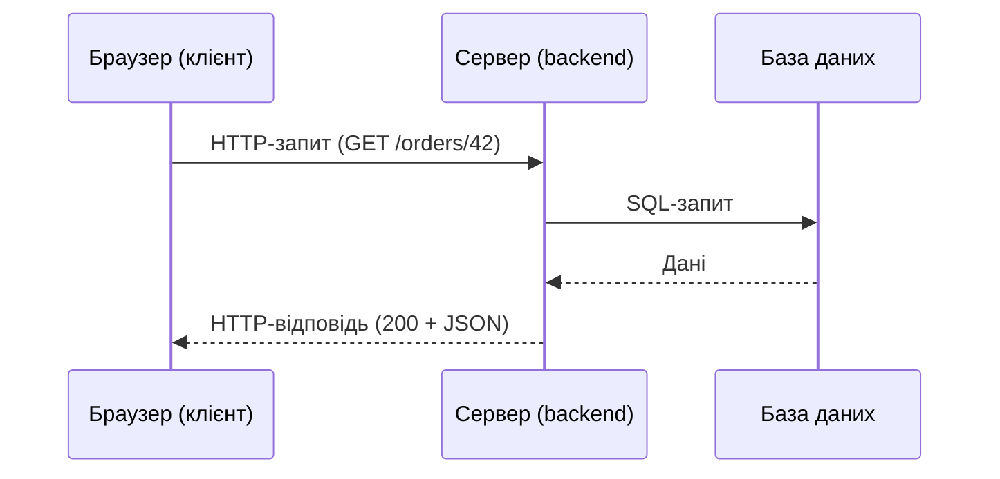

# Junior: Клієнт-серверна архітектура

Мета рівня: розуміти, що відбувається між натисканням кнопки в браузері та відповіддю на екрані, і вміти локалізувати, **де** виник дефект: у клієнті, у мережі, на сервері чи в даних.

## 1. Базова модель

- **Клієнт** надсилає запит (браузер, мобільний застосунок, інша служба).
- **Сервер** обробляє запит і повертає відповідь.
- **Протокол** (найчастіше HTTP/HTTPS) визначає формат обміну.

### Три шари застосунку
| Шар | Що робить | Приклади |
|---|---|---|
| Frontend (presentation) | Інтерфейс, валідація на стороні клієнта | HTML/CSS/JS, React, мобільний UI |
| Backend (business logic) | Правила, авторизація, API | Java, Node.js, Python, .NET |
| Database (data) | Зберігання даних | PostgreSQL, MySQL, MongoDB |

**Важливо для тестувальника:** валідація на клієнті зручна для користувача, але її легко обійти. Сервер завжди має перевіряти дані сам.

## 2. Адреса: URL

`https://shop.example.com:443/api/orders/42?status=paid&page=2#details`

| Частина | Значення |
|---|---|
| `https` | Схема (протокол) |
| `shop.example.com` | Хост (доменне ім'я) |
| `:443` | Порт (для https за замовчуванням) |
| `/api/orders/42` | Шлях; `42` це path-параметр (id ресурсу) |
| `?status=paid&page=2` | Query-параметри (фільтри, пагінація) |
| `#details` | Фрагмент, обробляється лише браузером |

## 3. HTTP: запит і відповідь

**Запит:** метод + URL + заголовки (headers) + тіло (body, не завжди).
**Відповідь:** статус-код + заголовки + тіло.

### Методи
| Метод | Призначення | Безпечний | Ідемпотентний |
|---|---|---|---|
| GET | Отримати ресурс | Так | Так |
| POST | Створити ресурс/виконати дію | Ні | Ні |
| PUT | Замінити ресурс повністю | Ні | Так |
| PATCH | Змінити частину ресурсу | Ні | Зазвичай ні |
| DELETE | Видалити ресурс | Ні | Так |

*Безпечний* означає, що метод не змінює стан; *ідемпотентний*, що повтор дає той самий кінцевий результат.

### Класи статус-кодів
| Клас | Значення | Часті коди |
|---|---|---|
| 1xx | Інформаційні | 101 |
| 2xx | Успіх | 200 OK, 201 Created, 204 No Content |
| 3xx | Перенаправлення | 301, 302, 304 Not Modified |
| 4xx | Помилка клієнта | 400 Bad Request, 401 Unauthorized, 403 Forbidden, 404 Not Found, 409 Conflict, 422, 429 Too Many Requests |
| 5xx | Помилка сервера | 500, 502 Bad Gateway, 503 Service Unavailable, 504 Gateway Timeout |

- **401** означає «ти не автентифікований» (немає чи недійсний токен); **403** означає «автентифікований, але прав немає».
- 5xx на коректний запит це завжди привід завести дефект.

### Корисні заголовки
`Content-Type` (формат тіла), `Accept` (який формат очікує клієнт), `Authorization` (токен), `Cookie` / `Set-Cookie`, `Cache-Control`, `User-Agent`, `Location` (куди перенаправляти).

## 4. Cookies, сесії, автентифікація

- **Authentication** — хто ви; **Authorization** — що вам дозволено.
- Після логіну сервер видає **сесію** (cookie з id) або **токен** (наприклад, JWT), який клієнт надсилає в наступних запитах.
- **Cookie** зберігається в браузері й автоматично додається до запитів на свій домен. **localStorage** зберігається в браузері, але автоматично не надсилається.
- Тест-ідеї: вихід із системи, закінчення сесії, доступ за чужим id, вставка старого токена.

## 5. HTTP vs HTTPS

HTTPS шифрує трафік (TLS) і підтверджує сервер сертифікатом. Перевіряйте: чи немає mixed content (HTTP-ресурси на HTTPS-сторінці), чи сертифікат дійсний, чи редірект з HTTP на HTTPS працює.

## 6. DevTools: ваш головний інструмент

У Chrome натисніть F12 → вкладка **Network**:
1. Увімкніть **Preserve log** (щоб не втратити запити під час переходів).
2. Фільтр **Fetch/XHR** покаже API-виклики.
3. Клікніть запит: **Headers** (метод, URL, статус, заголовки), **Payload** (що надіслано), **Response/Preview** (що отримано), **Timing** (скільки часу).
4. Правий клік → **Copy as cURL** дає відтворюваний запит для баг-репорту.
5. Throttling імітує повільну мережу; вкладка **Console** показує помилки JavaScript.

## 7. Як локалізувати проблему

| Симптом | Куди дивитись |
|---|---|
| Кнопка не реагує, запит не йде | Console (JS-помилка), клієнтська валідація |
| Запит пішов, статус 4xx | Тіло й заголовки запиту, токен, права, формат даних |
| Статус 5xx | Помилка на сервері: прикріпити запит/відповідь і час, звернутися до логів |
| 200, але на екрані неправильно | Порівняти відповідь API з тим, що показує UI (дефект UI чи даних) |
| Повільно | Timing у Network: DNS, очікування сервера (TTFB), завантаження |
| Працює в одному середовищі, не працює в іншому | Конфігурація, дані, версії, URL сервісів |

## 8. Середовища

`dev` → `test/QA` → `stage/pre-prod` → `prod`. Тестуйте на QA/stage, не змінюючи реальні дані. У дефекті завжди вказуйте середовище й версію збірки.

## Практика

1. Відкрийте будь-який сайт із логіном, виконайте вхід і знайдіть у Network запит логіну. Випишіть метод, URL, статус і яким чином передається токен/сесія.
2. Спробуйте відкрити сторінку для залогінених користувачів у приватному вікні й подивіться статус-код.
3. Скопіюйте запит як cURL і повторіть у терміналі.
4. Повільне з'єднання: увімкніть throttling і опишіть, як поводиться UI.
