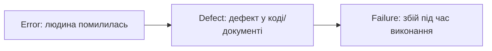

# Junior: ISTQB Foundation (CTFL v4.0)

Рівень **розуміння**: знати терміни, процес і основні техніки, виконувати готові тест-кейси та якісно описувати дефекти. Структура відповідає шести розділам силабусу Foundation Level.

---

## 1. Основи тестування

### Що таке тестування і навіщо воно
Тестування — це набір активностей, які дають змогу знайти дефекти й оцінити якість продукту. Воно складається з **динамічного** (виконання коду) і **статичного** (огляди, аналіз без виконання) підходів. Це не тільки «запустити й подивитись»: сюди входять планування, аналіз, проєктування, реалізація, виконання й завершення.

Тестування допомагає зменшити ризик збою на продакшні, перевірити, що вимоги виконано, і дати зацікавленим сторонам інформацію для рішень.

**Тестування ≠ налагодження (debugging).** Тестування виявляє збій; налагодження знаходить причину в коді й виправляє її (це роль розробника). Після виправлення тестувальник перевіряє виправлення (confirmation testing).

### Помилка, дефект, збій

- **Error (mistake)** — помилка людини (неправильно зрозумів вимогу).
- **Defect (bug)** — наслідок помилки в артефакті.
- **Failure** — видимий збій, коли дефектний код виконується за певних умов.
- Не кожен дефект спричиняє збій; збої можуть виникати також через умови середовища.
- **Root cause** — першопричина; її аналіз допомагає не повторювати дефекти.

### QA, QC і тестування
- **Quality assurance (QA)** — запобігання дефектам через процеси.
- **Quality control (QC)** — виявлення дефектів у продукті.
- **Testing** — одна з основних активностей QC.

### Сім принципів тестування
1. Тестування показує наявність дефектів, але не доводить їхню відсутність.
2. Вичерпне тестування неможливе: використовуйте ризики й пріоритети.
3. Раннє тестування економить час і гроші (shift-left).
4. Дефекти групуються: невелика частина модулів містить більшість дефектів.
5. Парадокс пестициду: незмінні тести з часом перестають знаходити нові дефекти, їх треба оновлювати.
6. Тестування залежить від контексту: для банку й для гри підходи різні.
7. Хибна думка про відсутність дефектів: система без дефектів, але не задовольняє потреби користувача, все одно провальна.

### Процес тестування (активності)
| Активність | Суть |
|---|---|
| Test planning | Визначити цілі, підхід, ресурси |
| Test monitoring & control | Порівнювати прогрес із планом, коригувати |
| Test analysis | Що тестувати: аналіз тестової основи, тестові умови |
| Test design | Як тестувати: тест-кейси, дані, оракул |
| Test implementation | Підготувати тестові набори, середовище, дані |
| Test execution | Виконати тести, порівняти результати, повідомити про дефекти |
| Test completion | Підсумки, архів, уроки |

Робочі продукти: тест-план, тест-кейси, чек-листи, звіти про дефекти, звіти про виконання. **Traceability** (простежуваність) пов'язує вимоги, тести та дефекти, тому легко побачити покриття й вплив змін.

### Люди й підходи
- Ролі: **test management** (планування, контроль) та **testing** (аналіз, дизайн, виконання).
- Корисні навички: допитливість, увага до деталей, комунікація, критичне мислення, технічна грамотність.
- **Whole-team approach**: якість — відповідальність усієї команди.
- **Незалежність** тестування допомагає бачити інші проблеми, але може погіршити комунікацію; найкраще працює баланс.

---

## 2. Тестування протягом життєвого циклу розробки (SDLC)

- Моделі: **Waterfall**, **V-model**, **ітеративні/інкрементальні**, **Agile** (Scrum, Kanban). Тестування має відповідати моделі: у Waterfall тести йдуть після розробки, у Agile вони постійні.
- **DevOps** і CI/CD: автоматичні перевірки при кожній зміні, швидкий зворотний зв'язок.
- **Shift-left**: залучати тестування від вимог (огляди історій, критерії прийняття).
- Ретроспективи допомагають покращувати процес.

### Рівні тестування
| Рівень | Що перевіряє | Хто зазвичай |
|---|---|---|
| Component (unit) | Окремий модуль/функцію | Розробник |
| Component integration | Взаємодію між компонентами | Розробник/тестувальник |
| System | Систему загалом (функції, нефункціональні властивості) | Тестувальники |
| System integration | Взаємодію з іншими системами | Тестувальники |
| Acceptance | Готовність до використання: UAT, operational, contractual/regulatory, alpha/beta | Користувачі, замовник |

### Типи тестування
- **Функціональне** — що система робить.
- **Нефункціональне** — як система працює: продуктивність, безпека, зручність, сумісність, надійність.
- **Black-box** — за специфікацією; **white-box** — за структурою коду.
- **Пов'язане зі змінами**: confirmation (чи виправлено дефект) і regression (чи не зламано наявне).

### Maintenance testing
Тестування після змін у вже працюючій системі: модифікація, міграція, виведення з експлуатації. Спершу роблять **impact analysis** (що змінилося і що це може зачепити).

---

## 3. Статичне тестування

Перевірка артефактів **без виконання** коду: вимоги, історії, дизайн, код, тест-кейси.

- Переваги: ранні дефекти, дешевше виправлення, краще розуміння вимог.
- Типові знахідки: неоднозначності, суперечності, пропуски, порушення стандартів кодування.
- Процес огляду: планування → ініціація → індивідуальний огляд → обговорення й аналіз → виправлення й звітність.
- Ролі: manager, author, moderator/facilitator, scribe, reviewer.
- Типи оглядів: **informal**, **walkthrough**, **technical review**, **inspection** (від найменш до найбільш формального).
- Успіх залежить від чітких цілей, відповідних людей, конструктивної атмосфери та достатнього часу.
- **Static analysis** — автоматичний аналіз коду (лінтери).

---

## 4. Аналіз і проєктування тестів

Три категорії технік: **black-box**, **white-box**, **experience-based**.

### Equivalence partitioning (EP)
Ділимо вхідні дані на класи, всередині яких система поводиться однаково; з кожного класу достатньо одного значення.
Поле «вік 18–60»: класи `<18` (невалідний), `18–60` (валідний), `>60` (невалідний).

### Boundary value analysis (BVA)
Помилки часто на межах. Для діапазону 18–60:
- 2-value: 17, 18, 60, 61
- 3-value: 17, 18, 19, 59, 60, 61

### Decision table
Комбінації умов → дії. Приклад:
| Умова | R1 | R2 | R3 | R4 |
|---|---|---|---|---|
| Клієнт має карту | Так | Так | Ні | Ні |
| Сума > 1000 | Так | Ні | Так | Ні |
| **Знижка** | 15% | 5% | 5% | 0% |

### State transition
Об'єкт має стани й переходи за подіями. Для замовлення: `Новий → Оплачений → Відправлений → Доставлений`; перевіряйте допустимі й недопустимі переходи (наприклад, «Доставлений → Новий»).

### White-box: statement і branch coverage
- **Statement coverage** — частка виконаних операторів.
- **Branch (decision) coverage** — частка виконаних гілок рішень. 100% branch coverage гарантує 100% statement coverage, але не навпаки.

### Experience-based
- **Error guessing** — досвід підказує типові помилки (порожні значення, дуже довгі рядки, спецсимволи).
- **Exploratory testing** — навчання, дизайн і виконання одночасно, часто за **чартером** і з обмеженням часу.
- **Checklist-based** — перевірка за списком, що оновлюється з досвідом.

### Колаборативний підхід
- **User story** + **acceptance criteria** (правилоорієнтовані чи сценарні, наприклад Given/When/Then).
- **ATDD** — тести прийняття формулюють до реалізації разом із бізнесом і розробниками.

---

## 5. Управління тестовою діяльністю

- **Test plan**: ціль, обсяг, підхід, ресурси, розклад, ризики, критерії входу й виходу.
- **Entry criteria / Definition of Ready**, **exit criteria / Definition of Done**.
- **Estimation**: на основі співвідношень, екстраполяції, Wideband Delphi, трьох точок.
- **Пріоритизація тестів**: за ризиком, за покриттям, за вимогами.
- **Test pyramid**: багато швидких unit-тестів, менше інтеграційних, ще менше UI/E2E. **Testing quadrants** допомагають збалансувати тести для бізнесу й для технологій.
- **Ризик = ймовірність × вплив.** Project risks (терміни, ресурси) відрізняються від product risks (якість продукту).
- **Моніторинг і звітність**: прогрес, пройдені/провалені тести, дефекти за серйозністю, метрики для рішень.
- **Configuration management**: версії збірок, тестових артефактів і середовищ мають бути відстежувані.

### Дефект-репорт
Вміст: ID, заголовок, дата, автор, середовище, кроки, фактичний і очікуваний результат, серйозність, пріоритет, докази (скріншот/лог), статус. Дивіться також скіл `qa-bug-report`.

| Severity | Priority |
|---|---|
| Технічний вплив на систему | Терміновість виправлення для бізнесу |
| Зазвичай визначає тестувальник | Зазвичай визначає продакт чи менеджер |

Приклад: помилка в логотипі на головній — низька серйозність, але може мати високий пріоритет.

---

## 6. Інструменти тестування

Типи: управління тестами та вимогами, статичний аналіз, дизайн і підготовка даних, виконання й покриття, нефункціональні тести (навантаження), DevOps/CI, співпраця, віртуалізація середовищ.

**Переваги автоматизації:** швидкість повторів, менше ручної рутини, послідовність, об'єктивні метрики.
**Ризики:** нереалістичні очікування, витрати на підтримку, залежність від інструмента, ненадійні (flaky) тести, помилкова довіра до зелених результатів.

---

## Практика

1. Візьміть форму реєстрації (будь-який сайт) і складіть 10 тест-кейсів із використанням EP та BVA.
2. Намалюйте діаграму станів для замовлення в інтернет-магазині та випишіть недопустимі переходи.
3. Оформіть один умовний дефект за шаблоном і поясніть різницю severity та priority.
4. Знайдіть у вимогах до будь-якої фічі три неоднозначності й сформулюйте уточнювальні запитання.
